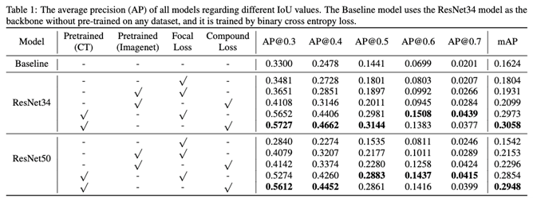

# pytorch retinanet for pneumonia detection
### forked from [pytorch-retinanet](https://github.com/yhenon/pytorch-retinanet)

## Contribution

- focal loss is used instead of cross entropy loss to to reduce the loss contribution from easy samples and increases the importance of correcting misclassified samples.
- modified loss function: ${\mathcal{L}}\_{FLIoU} = {\mathcal{L}}\_{FL} - IoU$  
  Since we want to maximize the bounding boxes' performance, we added $-IoU$ as a penalty term to the loss.
- Backbone model is pretrained on RSNA kaggle dataset instead of ImageNet dataset.

## Results

For details please see the [report](./report.docx) and the presentation [slides](./slides.pptx)
